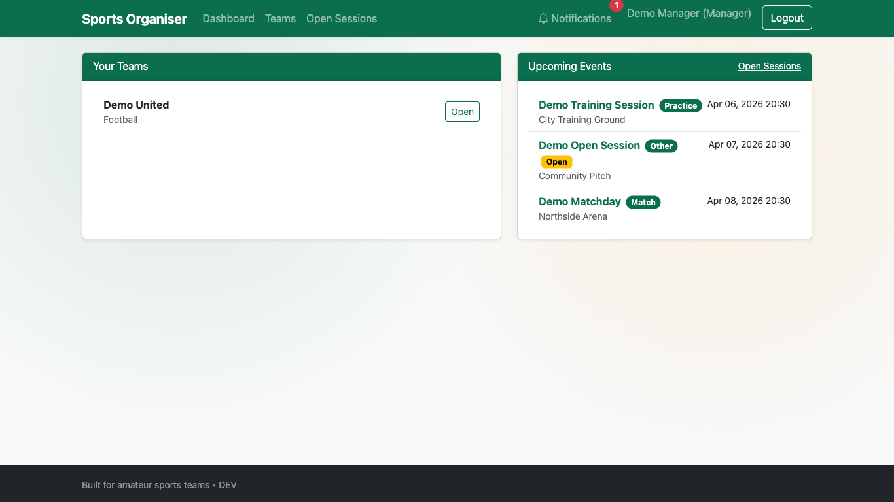
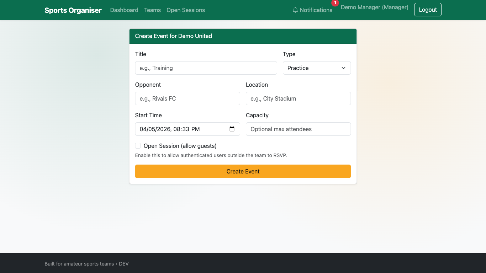
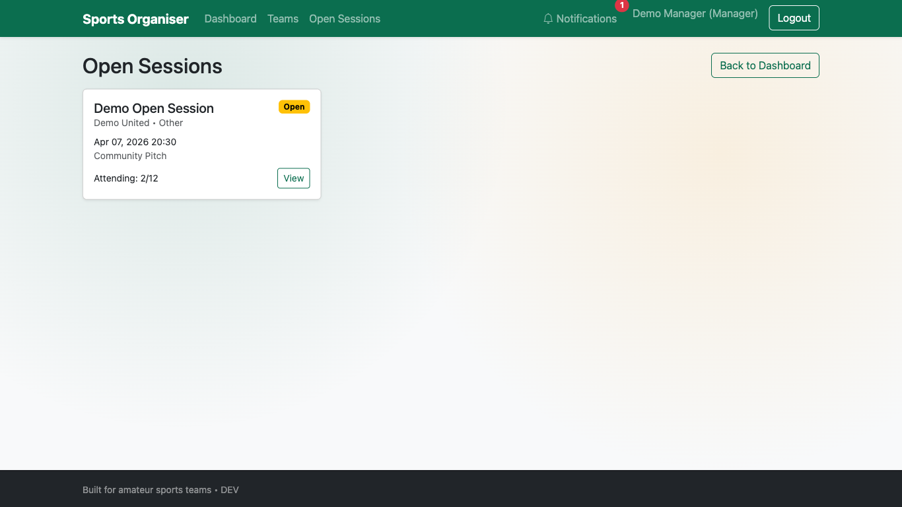
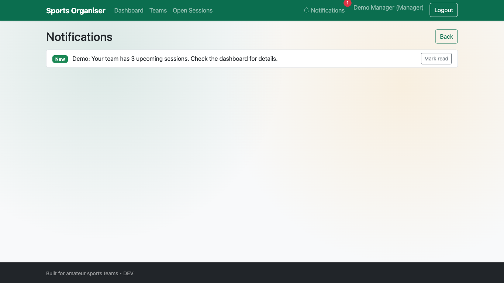
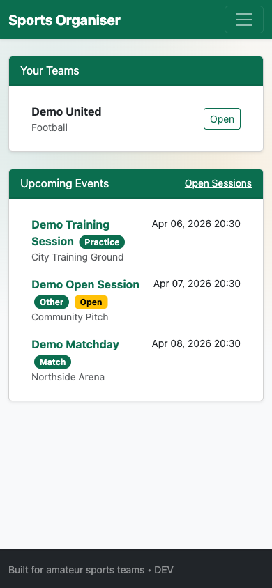

Amateur Sports Team Organiser (Flask)

Overview
- Flask web app to organise amateur sports teams with role-based access control (manager, team_leader, player).
- Postgres database runs in Docker; app can run locally or in Docker.
- Sports-themed, professional UI built with Bootstrap + custom CSS.

Screenshots

Dashboard (Desktop)

Create Event (Desktop)

Open Sessions (Desktop)

Notifications (Desktop)

Dashboard (Mobile)

Background (Summary)
- Many grassroots clubs rely on WhatsApp/spreadsheets, leading to missed info and unclear availability.
- Existing tools are often complex/paid or ad-driven and not tailored to small UK teams.
- This app focuses on a simple, mobile-friendly organiser with scheduling, availability, and optional “open sessions” to fill missing players.

Quick Start
0) One-command start (recommended):
   - `./start.sh`
   - This starts Docker Postgres, installs Python deps into `.venv`, applies migrations, seeds demo content, and runs Flask.

1) Copy `.env.example` to `.env` and adjust values if needed.
2) Start Postgres via Docker:
   - `docker compose up -d db`
3) Create a virtualenv and install deps:
   - `python3 -m venv .venv && source .venv/bin/activate`
   - `pip install -r requirements.txt`
4) Initialize the database (first run):
   - `flask db init` (only once)
   - `flask db migrate -m "init"`
   - `flask db upgrade`
5) (Optional) Create a first manager account:
   - `flask create-user --name "Your Name" --email you@example.com --role manager`
6) Run the app:
   - `flask run`

Demo Accounts (Development)
- manager
   - Email: `manager@example.com`
   - Password: `Manager123`
- team_leader
   - Email: `leader@example.com`
   - Password: `Leader123`
- player
   - Email: `player@example.com`
   - Password: `Player123`

Security note: these are development-only credentials and should not be used in production.

Demo Interactive Content
- The startup script runs `flask seed-demo` to provide interactive sample data in:
   - Dashboard
   - Teams
   - Open Sessions
   - Notifications

Run Regression Tests
- Install dependencies, then run:
   - `pytest -q`
- Tests cover requirement behaviors and setup reliability guards: registration authorization (FR1), upcoming filtering (FR2), open-session UI controls (FR5), open-session availability filtering (FR6), and core dependency checks (NFR4).

Formal Requirements Validation
- A full FR1-FR6 and NFR1-NFR4 validation record is available in `REQUIREMENTS_VALIDATION.md`.
- The record includes automated test evidence plus Playwright-assisted desktop/mobile verification.

Docker (optional) Run
- Build and run both app and db in Docker:
  - `docker compose up --build`

Default Roles and UAC
- manager: create teams, assign leaders, manage roster and schedule.
- team_leader: manage roster for their team, create events for their team.
- player: view their team, roster, and schedule.

Registration and Authorization
- Public registration always creates `player` accounts.
- `manager` and `team_leader` roles are organiser-assigned (not self-selectable from the public registration form).

Functional Coverage (from report)
- FR1 sessions with date/time/location: Event create/edit for managers/leaders.
- FR2 single view of sessions: Dashboard and team detail show upcoming sessions only.
- FR3 availability per session: RSVP on event detail (yes/maybe/no).
- FR4 notify on changes: in-app notifications on event updates/creation.
- FR5 mark sessions open: create/edit event UI exposes open-session and capacity controls.
- FR6 show open sessions to fill: Open Sessions lists future sessions that still have available slots.

Features (Aligned to Objectives)
- Simple scheduling, availability tracking (RSVP), and open sessions to support flexible participation.
- Clear information architecture: single place to see upcoming team events and respond.
- Mobile-friendly UI using Bootstrap.

Email Notifications (Formsubmit)
- Optional email notifications via Formsubmit (no SMTP server needed).
- Notifications are sent on event creation/updates to team members/attendees.

Configure
1) Copy `.env.example` to `.env` and set:
   - `FORMSUBMIT_ENABLED=1` to enable sending
   - Choose ONE mode:
     - Aggregator mode (recommended): `FORMSUBMIT_PER_USER=0` and set `FORMSUBMIT_RECIPIENT=club.notify@example.com`
     - Per-user mode: `FORMSUBMIT_PER_USER=1` (each recipient receives their own message; each recipient must verify with Formsubmit)
   - Optional branding:
     - `FORMSUBMIT_FROM=no-reply@asto.local`
     - `FORMSUBMIT_SENDER_NAME=ASTO Notifications`
     - `FORMSUBMIT_SUBJECT_PREFIX=[ASTO]`

Verify Recipients (Formsubmit requirement)
- Formsubmit requires a one-time verification for each destination email address.
- Use the CLI to send a test email to trigger verification:
  - Aggregator mode: `flask send-test-email` (uses `FORMSUBMIT_RECIPIENT`)
  - Per-user mode: `flask send-test-email --to player@example.com`
- Click the verification link in the inbox. After verification, emails will deliver normally.

What Triggers Emails
- New event created (subject: “New <type>: <title>”).
- Event updated (subject: “Event updated: <title>”). Recipients are team members and current attendees.
- RSVP change to Yes (subject: “RSVP Yes: <title>”). Recipients are the team manager and team leaders.

Project Structure
- `app/` core Flask application (blueprints, models, forms, templates, static)
- `config.py` configuration (env-driven)
- `wsgi.py` app entrypoint (for production servers)
- `docker-compose.yml` Postgres + optional app service
- `Dockerfile` container build for the app
- `requirements.txt` Python dependencies

Environment
- Set `DATABASE_URL` to a Postgres URL. `.env.example` provides a working default targeting the bundled Docker Postgres.
- `FLASK_APP=wsgi.py` and `FLASK_DEBUG=1` for dev.

Notes
- I couldn’t extract the linked PDF in this environment, so this build implements a solid baseline. If you share key requirements from the document, I can refine data models, pages, and permissions to match exactly.
